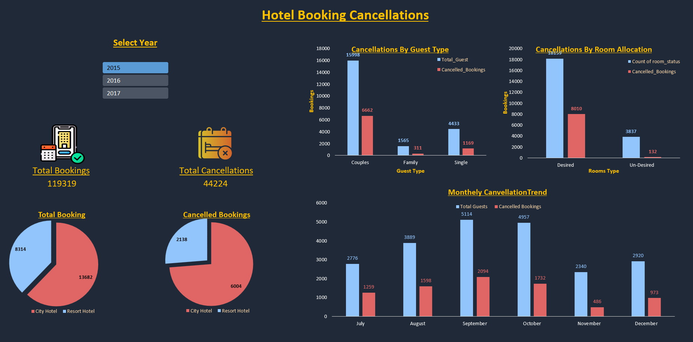
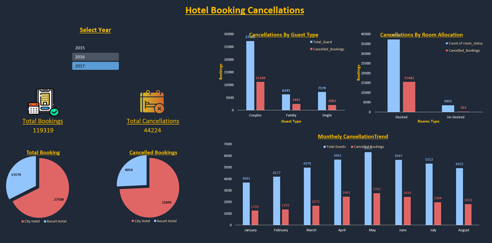

# Hotel Booking Cancellation Analysis Dashboard 🏨📊

An interactive, corporate-grade Excel Dashboard analyzing hotel booking cancellation patterns using data sourced from Kaggle. 

## 🚀 Interactive Dashboard Previews
Click on the years below to view how the dashboard dynamically updates for each year:

📸 Click here to view 2015 Dashboard

📸 Click here to view 2016 Dashboard (Full Year Data)

📸 Click here to view 2017 Dashboard

## 🧠 Key Insights Covered in this Dashboard
- **Cancellations by Guest Type:** Analysis of cancellation behavior among Couples, Families, and Single guests.
- **Cancellations by Room Allocation:** Impact of guests not receiving their desired/preferred room types on cancellation rates.
- **Monthly Cancellation Trends:** Time-series visualization tracking total bookings vs. cancellations from January to December.
- **KPI Metrics:** High-level tracking of Total Bookings (119K+) vs. Total Cancellations (44K+).

## 🛠️ Tools & Techniques Used
- **Data Source:** Kaggle Hotel Booking Dataset.
- **Data Engineering:** Data Cleaning, Find & Replace formatting, and Data Tuning.
- **Data Modeling:** Built multiple optimized Pivot Tables on a separate backend sheet (`pivot`) to aggregate complex booking and cancellation attributes.
- **Dynamic Slicers:** Connected Pivot Tables using Report Connections to enable global, one-click interactivity across the entire dashboard.
- **UI/UX Design:** Dark Mode Corporate Theme (`#1f2937`), custom-styled synchronized slicers, pixel-perfect layout alignment, and borderless chart integration.

## 📂 How to View the Interactive Dashboard
1. Download the `Hotel_Booking_Cancellation_Analysis.xlsx` file from this repository.
2. Open it in Microsoft Excel.
3. Use the **Arrival Year Slicer** to interactively filter data across 2015, 2016, and 2017.
